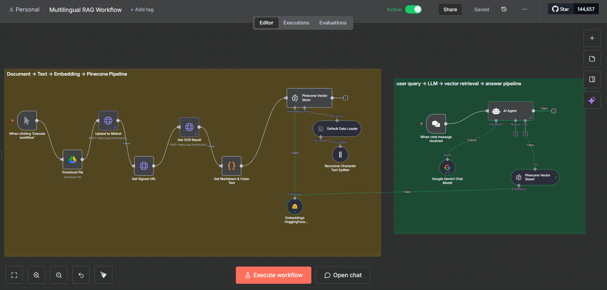
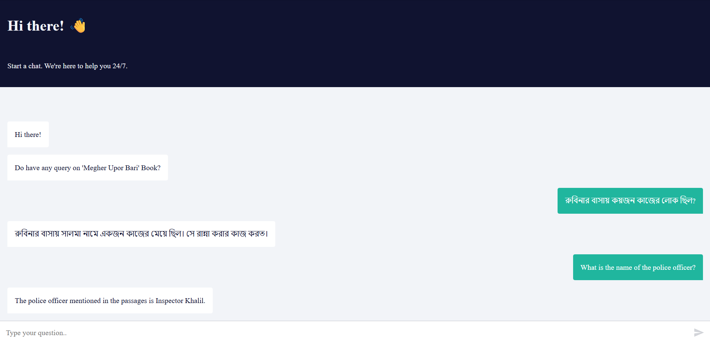

# 🌐 Multilingual RAG System (Bangla + English)

A **Multilingual Retrieval-Augmented Generation (RAG) System** built using **n8n Cloud**, **Pinecone**, **HuggingFace**, and **Google Gemini**. The system is capable of handling both **English** and **Bangla** queries related to the Bangla book *Megher Upor Bari* by **Humayun Ahmed**.

## 🧠 Features
- 📝 **Document to Text**: OCR and markdown cleaning to extract book content.  
- ✂ **Chunking & Embedding**: Recursive character splitting and embedding using HuggingFace and Pinecone.  
- 🌍 **Multilingual Query Support**: The system answers both **English** and **Bangla** queries.  
- 💬 **Hosted Chat Interface**: Users can interact with the RAG system using a live chatbot.  
- 🔍 **RAG Pipeline**: Uses Pinecone for vector retrieval and Google Gemini for answer generation.

---

## 🏗️ Architecture Diagram

- **Left side**: Document pipeline (OCR extraction → cleaning → chunking → embedding → Pinecone)  
- **Right side**: User query pipeline (query embedding → Pinecone retrieval → Google Gemini answer generation)

---

## 🚀 Setup Instructions

1. **Import the Workflow**
   - Download the [`multilingual-rag-n8n-workflow.json`](./Multilingual-RAG-n8n-Workflow.json) file.  
   - In **n8n**, click **Import** → select the JSON file to load the workflow.

2. **Set Up API Keys**  
   Ensure you have valid API keys for the following services:
   - **Mistral AI** for OCR
   - **HuggingFace** for embeddings.
   - **Pinecone** for vector database storage and retrieval.
   - **Google Gemini** for answer generation.

4. **Execute the Document Pipeline**  
   Run this pipeline **once** to process the book content into embeddings and store them in Pinecone.

5. **Activate the User Query Pipeline**  
   Use the **Hosted Chat URL** or **Webhook** to send queries to the system.

---

## 💬 **Hosted Chat Interface**

You can interact with the system through the following public chat interface:

👉 [Click here to open the chatbot](https://rahmanniloy.app.n8n.cloud/webhook/7e7e36fc-4ab4-4791-b8c6-b0b1370479e3/chat)

**Instructions**:  
- Type your query in either **English** or **Bangla** (e.g., “What is the name of the police officer??” or “পুলিশ অফিসারের নাম কী??”).  
- The system will retrieve relevant content from the book *Megher Upor Bari* and generate an answer using the RAG pipeline.

## 📸 **Hosted Chat Output Screenshot**

## 🧰 Tools & Libraries Used
- **n8n Cloud**: Workflow automation platform.  
- **HuggingFace**: `sentence-transformers/paraphrase-multilingual-MiniLM-L12-v2` for embeddings (Dimensions: 384).  
- **Pinecone**: Vector database for storing and retrieving embeddings.  
- **Mistral AI**: OCR service for text extraction from scanned documents.  
- **Google Gemini 2.5**: LLM model for generating answers based on retrieved context.

---

## 📝 Answers to Required Questions

1. **What method or library did you use to extract the text, and why?**  
   I used **Mistral AI** for OCR extraction because the document’s text could not be extracted directly. OCR allows us to digitize and retrieve the text from images.

2. **What chunking strategy did you choose and why?**  
   I used **Recursive Character Text Splitter** with a **chunk size of 500 characters** and **200-character overlap**. This ensures enough context is preserved across chunks while splitting the text into manageable parts.

3. **What embedding model did you use, why, and how does it capture meaning?**  
   I used **HuggingFace’s `sentence-transformers/paraphrase-multilingual-MiniLM-L12-v2`** model.  
   - **Dimensions**: 364  
   - This model supports **multilingual text** (both English and Bangla), providing high-quality, dense embeddings that capture semantic meaning for efficient similarity comparison.

4. **How are you comparing the query with your stored chunks, and why did you choose this?**  
   I used **Pinecone** for vector similarity search. I selected this approach because it efficiently retrieves the most relevant document chunks by comparing the query’s embedding with stored chunk embeddings.

5. **How do you ensure meaningful comparison? What if the query is vague?**  
   I ensure meaningful comparison by using the same embedding model for both the query and document chunks. If the query is vague, the system may retrieve multiple possible answers, and **Google Gemini** uses the context to refine the answer.

6. **Do the results seem relevant? If not, what might improve them?**  
   Yes, the results are highly relevant. However, the system could be improved by:
   - Using **larger document chunks** for more context.
   - Fine-tuning the **embedding model** to improve accuracy further.

---

## 📌 **Important Notes**
- **Hosted Chat URL**: The chat will remain active during the evaluation period. If the n8n trial expires, the workflow can be re-imported and activated.
- **Dependencies**: Ensure valid API keys for **HuggingFace**, **Pinecone**, and **Google Gemini** before running the workflow.

---

## 👨‍💻 **Author / Contact**
- **Name**: Nafiur Rahman Niloy
- **Email**: nafiurrahman52@gmail.com

---

